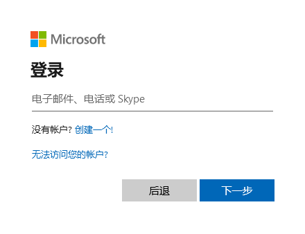
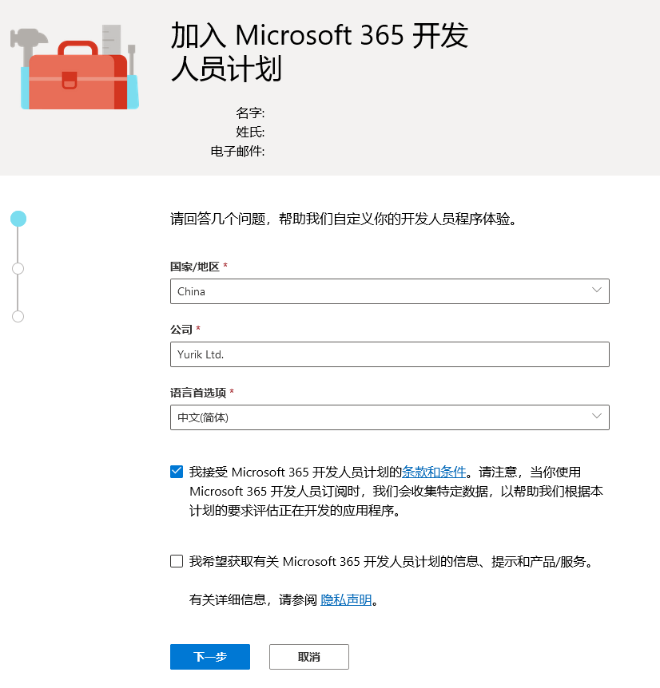
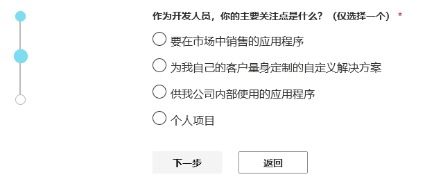
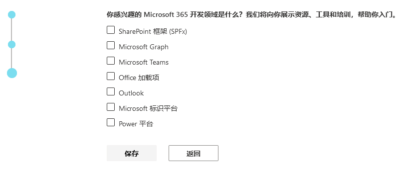
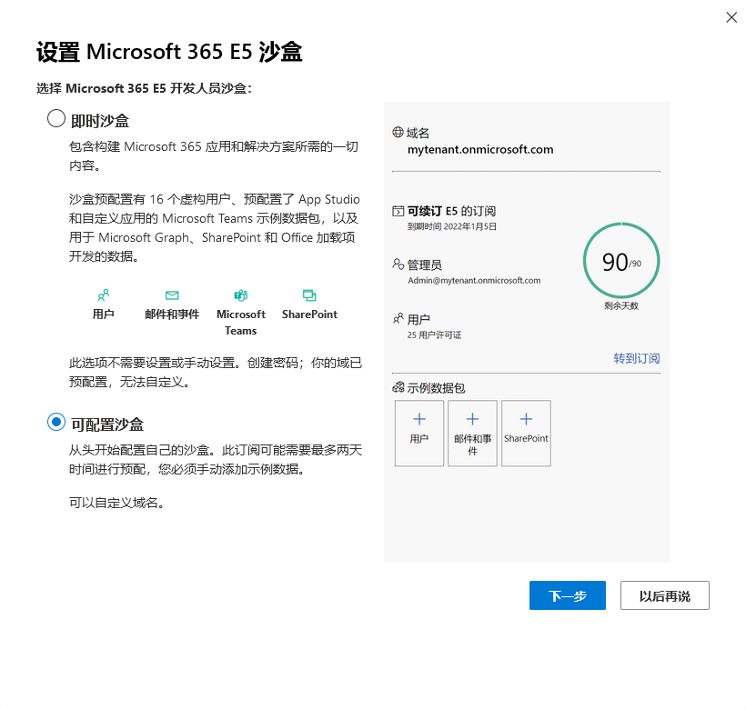
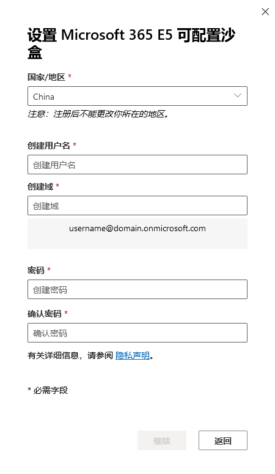
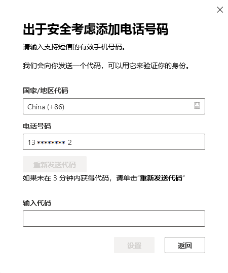
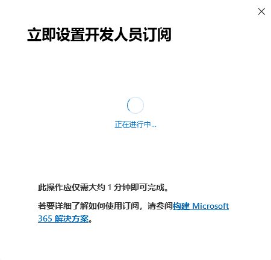
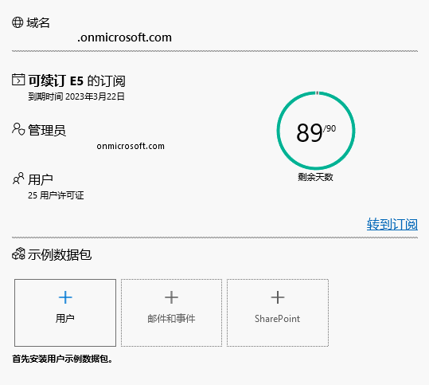

## 申请教程

进入[**申请链接**](https://developer.microsoft.com/zh-cn/microsoft-365/dev-program)，点击**立即加入**，登录你的微软账户

> 别忘了去[**个人资料**](https://account.microsoft.com/profile/)添加自己的姓氏和名称，不然无法注册
>
> 姓名添加后可能需要等待几个小时后才可以注册

选择你的 **国家/地区**, 填写你的公司名称, 勾选同意协议

接下来的几个页面自己看着选就可以啦

在 **设置 Microsoft 365 E5 沙盒** 页面中选择 **可配置沙盒**

填写 **管理员用户名** 、 **域** 和 **管理员密码**

> 若域冲突请换用其它的域名称

在弹出的页面中输入手机号并填写验证码

稍安勿躁，等待一会儿后就申请成功了

